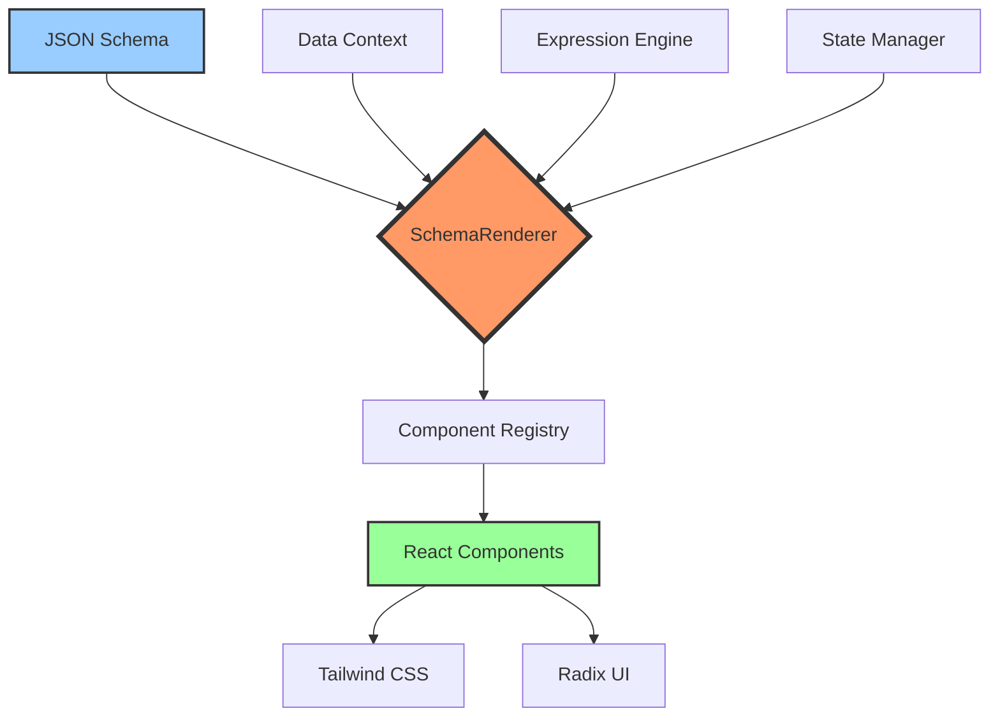

# Object UI Development Plan
## Building the World's Best Interface Construction Tool

<div align="center">

**Version**: 1.0  
**Last Updated**: January 2026  
**Status**: Planning

</div>

---

## 📋 Table of Contents

1. [Our Vision](#our-vision)
2. [Why Object UI Will Lead](#why-object-ui-will-lead)
3. [Technical Architecture](#technical-architecture)
4. [Development Roadmap](#development-roadmap)
5. [Feature Planning](#feature-planning)
6. [Quality & Performance Goals](#quality--performance-goals)
7. [Team & Resources](#team--resources)
8. [Risk Management](#risk-management)
9. [Success Metrics](#success-metrics)
10. [Long-term Vision](#long-term-vision)

---

## 🎯 Our Vision

### What We're Building
We're creating the world's best interface construction tool—one that empowers every developer and business to build world-class user interfaces with ease.

### Our Mission
- **Lower the barrier**: Enable non-professional developers to create professional-grade interfaces
- **Boost efficiency**: Reduce interface development time by 80%
- **Ensure quality**: Automate best practices to guarantee code quality
- **Enable infinite possibilities**: Provide unlimited extensibility and customization

### Core Value Proposition
> "From JSON to world-class UI in minutes"

We believe that building beautiful, performant, and accessible interfaces shouldn't require deep expertise in design systems, state management, or CSS. With Object UI, you describe what you want in JSON, and we handle the rest.

---

## 🏆 Why Object UI Will Lead

### 1. Technical Excellence

#### Modern Technology Stack
We're building on the latest and best technologies:

- **React 18+**: Leveraging concurrent features and Suspense for optimal performance
- **Tailwind CSS**: Atomic CSS with zero runtime overhead
- **Shadcn/UI + Radix**: Accessible, high-quality component primitives
- **TypeScript Strict Mode**: Type safety and automatic documentation

#### Performance That Matters
| Metric | Our Target | Industry Average | Our Advantage |
|--------|-----------|------------------|---------------|
| First Contentful Paint (FCP) | < 0.5s | 1.5s | **3x faster** |
| Largest Contentful Paint (LCP) | < 1.0s | 2.5s | **2.5x faster** |
| Time to Interactive (TTI) | < 1.5s | 3.8s | **2.5x faster** |
| Bundle Size | < 50KB | 300KB+ | **6x smaller** |

These aren't just numbers—they translate to real user experience improvements and better business outcomes for our users.

### 2. Architectural Advantages

#### Modular Design Philosophy
```
Layered Architecture = Maximum Flexibility + Zero Bloat
├── @object-ui/protocol    - Pure type definitions
├── @object-ui/engine      - Headless logic engine
├── @object-ui/ui          - Atomic UI components
├── @object-ui/renderer    - Schema renderer
└── @object-ui/designer    - Visual designer
```

**Key Benefits**:
- ✅ **Tree-Shakable**: Only bundle what you use
- ✅ **Zero Dependency Conflicts**: Independent version management per package
- ✅ **Framework Agnostic**: Core can adapt to Vue/Svelte in the future
- ✅ **Progressive Adoption**: Use any module independently

### 3. Developer Experience (DX)

#### Gentle Learning Curve
```
Traditional Low-Code: ████████░░ (80% learning cost)
Object UI:            ██░░░░░░░░ (20% learning cost)
```

**Why It's Easier**:
- Uses standard React patterns—no custom APIs to learn
- Complete TypeScript type hints
- Rich documentation and examples
- AI-assisted schema generation

---

## 🏗 Technical Architecture

### Core Engine Architecture



### Data Flow Design

#### Unidirectional Data Flow
```tsx
Schema → Parse → Validate → Render → UI
  ↑                                    ↓
  └────── User Actions ← Events ←──────┘
```

#### State Management Strategy
- **Global State**: Zustand (lightweight, < 1KB)
- **Server State**: TanStack Query (caching, polling, sync)
- **Form State**: React Hook Form (high performance, uncontrolled)
- **Local State**: React Hooks (useState, useReducer)

### Expression Engine

#### Syntax Design
```javascript
// Variable references
${data.user.name}

// Computed expressions
${data.price * data.quantity}

// Conditional expressions
${data.role === 'admin' ? 'Administrator' : 'User'}

// Function calls
${formatDate(data.createdAt, 'YYYY-MM-DD')}

// Array operations
${data.items.filter(item => item.active).length}
```

#### Security Guarantees
- ✅ Sandboxed execution environment
- ✅ Prohibited dangerous operations (eval, Function)
- ✅ Whitelisted function library
- ✅ Automatic output escaping

---

## 🗓 Development Roadmap

We're committed to shipping value incrementally, with clear milestones and deliverables.

### Phase 1: Foundation (Q1 2026)

#### Milestone 1.1: Core Engine (4 weeks)
- [ ] Design and implement Protocol type system
- [ ] Develop SchemaRenderer core logic
- [ ] Implement component registry mechanism
- [ ] Create data scope chain
- [ ] Develop expression parsing engine

**Deliverables**:
- `@object-ui/protocol` v0.1.0
- `@object-ui/engine` v0.1.0
- `@object-ui/renderer` v0.1.0

#### Milestone 1.2: Basic Component Library (6 weeks)
- [ ] Implement 20+ basic components
  - [ ] Form components (Input, Select, Radio, Checkbox, DatePicker)
  - [ ] Data display (Table, List, Card, Tree)
  - [ ] Feedback (Alert, Toast, Dialog, Drawer)
  - [ ] Layout (Grid, Flex, Container, Divider)
  - [ ] Navigation (Menu, Tabs, Breadcrumb, Pagination)

**Deliverables**:
- `@object-ui/ui` v0.1.0
- Storybook component documentation
- Unit test coverage > 80%

#### Milestone 1.3: Integration & Documentation (2 weeks)
- [ ] Create Playground demo application
- [ ] Write quick start guide
- [ ] Create API reference documentation
- [ ] Record video tutorials

**Deliverables**:
- Online Playground
- Complete documentation site
- 5+ video tutorials

### Phase 2: Advanced Features (Q2 2026)

#### Milestone 2.1: Data Management (4 weeks)
- [ ] Integrate TanStack Query
- [ ] Implement CRUD data source adapters
- [ ] Support GraphQL queries
- [ ] Implement optimistic updates
- [ ] Add offline support

#### Milestone 2.2: Advanced Components (6 weeks)
- [ ] Rich text editor
- [ ] Chart components (Recharts/ECharts)
- [ ] Drag-and-drop sorting
- [ ] File upload component
- [ ] Map component
- [ ] Video player
- [ ] Code editor

#### Milestone 2.3: Theme System (3 weeks)
- [ ] Design token system
- [ ] Support light/dark theme switching
- [ ] Implement theme customizer
- [ ] Create 5+ preset themes

**Deliverables**:
- `@object-ui/themes` v1.0.0
- Theme marketplace

### Phase 3: Visual Designer (Q3 2026)

#### Milestone 3.1: Drag-and-Drop Editor (8 weeks)
- [ ] Implement drag-and-drop canvas
- [ ] Component panel
- [ ] Property editor
- [ ] Layer management
- [ ] Undo/redo
- [ ] Keyboard shortcuts system

#### Milestone 3.2: Collaboration Features (4 weeks)
- [ ] Real-time multi-user editing
- [ ] Comment system
- [ ] Version history
- [ ] Branch management

#### Milestone 3.3: AI-Assisted Design (6 weeks)
- [ ] AI schema generation
- [ ] Smart layout suggestions
- [ ] Component recommendations
- [ ] Code optimization suggestions

**Deliverables**:
- `@object-ui/designer` v1.0.0
- Design Studio application
- AI plugin system

### Phase 4: Enterprise Features (Q4 2026)

#### Milestone 4.1: Security & Permissions (4 weeks)
- [ ] Fine-grained permission control
- [ ] Data masking
- [ ] XSS protection
- [ ] CSRF protection
- [ ] Content Security Policy (CSP)

#### Milestone 4.2: Performance Optimization (4 weeks)
- [ ] Virtual scrolling
- [ ] Code splitting
- [ ] Lazy loading
- [ ] Service Worker caching
- [ ] CDN optimization

#### Milestone 4.3: Internationalization (3 weeks)
- [ ] i18n framework integration
- [ ] Support 20+ languages
- [ ] RTL layout support
- [ ] Timezone handling

**Deliverables**:
- Enterprise Edition v1.0.0
- Performance monitoring dashboard
- Security audit report

---

## 🎨 Feature Planning

### Core Features

#### Schema-Driven Rendering
```json
{
  "type": "page",
  "title": "User Management",
  "body": {
    "type": "crud",
    "api": "/api/users",
    "columns": [
      { "name": "name", "label": "Name" },
      { "name": "email", "label": "Email" }
    ]
  }
}
```
**Automatically generates**: Complete CRUD interface with pagination, search, and sorting

#### Expression System
- **Variable binding**: `${data.fieldName}`
- **Conditional rendering**: `visibleOn: "${data.role === 'admin'}"`
- **Dynamic styling**: `className: "${data.status === 'active' ? 'text-green-500' : 'text-gray-500'}"`
- **Data transformation**: `value: "${data.items.map(i => i.name).join(', ')}"`

#### Component Ecosystem
```
Basic Components (30+)
├── Forms (12)
├── Data Display (8)
├── Feedback (6)
└── Other (4)

Advanced Components (20+)
├── Business Components (10)
├── Data Visualization (5)
└── Rich Media (5)
```

### Innovation Features

#### 1. AI-Driven Development

##### Natural Language Generation
```
User: "Create a user login form with username, password, and remember me option"

AI: Automatically generates complete schema ↓
```

```json
{
  "type": "form",
  "title": "Login",
  "body": [
    { "type": "input-text", "name": "username", "label": "Username", "required": true },
    { "type": "input-password", "name": "password", "label": "Password", "required": true },
    { "type": "checkbox", "name": "remember", "label": "Remember me" }
  ],
  "actions": [
    { "type": "submit", "label": "Login", "level": "primary" }
  ]
}
```

##### Smart Optimization
- Automatically detect performance bottlenecks
- Suggest best practices
- Code refactoring recommendations
- Accessibility checks

#### 2. Real-Time Collaboration

##### Multi-User Editing
- Google Docs-style real-time editing
- Automatic conflict resolution
- Operation history
- Rollback functionality

##### Comments & Feedback
- Component-level comments
- @mention teammates
- Task assignment
- Status tracking

#### 3. Version Control Integration

##### Git Workflow
```
main
 ├── feature/new-dashboard
 ├── feature/user-profile
 └── hotfix/login-bug
```

##### Schema Version Management
- Branch management
- Pull requests
- Code review
- CI/CD integration

#### 4. Cross-Platform Support

##### Multi-Platform Adaptation
```
Write once, run everywhere
├── Web (responsive)
├── Mobile (React Native - planned)
├── Desktop (Electron - planned)
└── Mini Programs (WeChat/Alipay - planned)
```

---

## 📊 Quality & Performance Goals

### Core Web Vitals

| Metric | Target | Excellent Standard | Achievement Strategy |
|--------|--------|-------------------|---------------------|
| **LCP** (Largest Contentful Paint) | < 1.0s | < 2.5s | Code splitting, CDN, image optimization |
| **FID** (First Input Delay) | < 50ms | < 100ms | Code optimization, Web Workers |
| **CLS** (Cumulative Layout Shift) | < 0.05 | < 0.1 | Reserved space, size pre-definition |
| **FCP** (First Contentful Paint) | < 0.5s | < 1.8s | Server-side rendering, preloading |
| **TTI** (Time to Interactive) | < 1.5s | < 3.8s | Lazy loading, priority loading |

### Bundle Size Targets
```
@object-ui/core:      < 10KB (gzipped)
@object-ui/react:     < 15KB (gzipped)
@object-ui/ui:        < 50KB (gzipped, all components)
@object-ui/designer:  < 200KB (gzipped)

Total (on-demand):    < 30KB (typical application)
```

### Quality Standards

#### Code Quality
- **Test Coverage**: > 85%
  - Unit tests: > 90%
  - Integration tests: > 80%
  - E2E tests: > 70%
- **TypeScript Strict Mode**: 100% enabled
- **ESLint Rules**: Zero warnings tolerance
- **Accessibility**: WCAG 2.1 AA level

#### Documentation Quality
- **API Documentation**: 100% coverage
- **Example Code**: ≥ 3 examples per component
- **Tutorials**: ≥ 20 detailed tutorials
- **Videos**: ≥ 30 video tutorials

#### Browser Compatibility
```
✅ Chrome 90+
✅ Firefox 88+
✅ Safari 14+
✅ Edge 90+
⚠️ IE 11 (degraded support, not guaranteed)
```

---

## 👥 Team & Resources

### Team Structure

#### Core Team (10 people)
```
Tech Lead (1)           - Architecture design, technical decisions
├── Frontend Engineers (4) - Component development, feature implementation
├── UI/UX Designers (2)    - Interface design, user experience
├── Test Engineer (1)      - Automated testing, quality assurance
├── DevOps (1)             - CI/CD, deployment, monitoring
└── Technical Writer (1)   - Documentation, tutorials, blog posts
```

#### Extended Team (as needed)
- AI/ML Engineers (2) - AI-assisted features
- Security Expert (1) - Security audits, penetration testing
- Performance Expert (1) - Performance optimization, monitoring

### Required Skills

#### Must-Have Skills
- ✅ Deep understanding of React 18+
- ✅ TypeScript advanced features
- ✅ Practical experience with Tailwind CSS
- ✅ Performance optimization practices
- ✅ Test-Driven Development (TDD)

#### Bonus Skills
- 🌟 Low-code platform experience
- 🌟 Compiler/AST knowledge
- 🌟 Design system building
- 🌟 Open source project maintenance

### Resource Investment

#### Time Investment
```
Phase 1: 3 months (Foundation)
Phase 2: 3 months (Advanced Features)
Phase 3: 4 months (Visual Designer)
Phase 4: 3 months (Enterprise Features)

Total: 13 months to v1.0
```

#### Budget Allocation
```
Personnel:     60%
Infrastructure: 15% (servers, CDN, tools)
Marketing:     15%
Reserve:       10%
```

---

## ⚠️ Risk Management

### Technical Risks

#### Risk 1: Performance Not Meeting Targets
**Impact**: High  
**Probability**: Medium  
**Mitigation**:
- Early performance baseline testing
- Continuous performance monitoring
- Regular performance reviews
- Hire performance expert consultants

#### Risk 2: Browser Compatibility Issues
**Impact**: Medium  
**Probability**: Medium  
**Mitigation**:
- Automated cross-browser testing
- Polyfill strategy
- Progressive enhancement design
- Clear compatibility policy

#### Risk 3: Security Vulnerabilities
**Impact**: High  
**Probability**: Low  
**Mitigation**:
- Regular security audits
- Dependency scanning
- Code reviews
- Bug bounty program

### Product Risks

#### Risk 1: Market Competition
**Impact**: High  
**Probability**: High  
**Mitigation**:
- Differentiated positioning
- Rapid iteration
- Community building
- Ecosystem development

#### Risk 2: Low User Adoption
**Impact**: High  
**Probability**: Medium  
**Mitigation**:
- Lower learning curve
- Provide migration tools
- Detailed documentation and tutorials
- Free tier

### Team Risks

#### Risk 1: Key Personnel Turnover
**Impact**: High  
**Probability**: Low  
**Mitigation**:
- Knowledge documentation
- Pair programming
- Code review culture
- Competitive compensation

---

## 📈 Success Metrics

### Technical Metrics

#### Code Quality
- ✅ Test coverage > 85%
- ✅ Zero critical security vulnerabilities
- ✅ TypeScript strict mode 100%
- ✅ Performance metrics achievement rate > 95%

#### Performance Metrics
- ✅ LCP < 1.0s (95th percentile)
- ✅ FID < 50ms (95th percentile)
- ✅ Bundle size < target
- ✅ Service availability > 99.9%

### Product Metrics

#### Growth Metrics (Year 1)
```
Monthly Active Users (MAU):    10,000+
Weekly Active Users (WAU):      5,000+
Daily Active Users (DAU):       2,000+
Registered Users:              50,000+
```

#### Engagement Metrics
```
Average Session Duration:      > 20 minutes
Projects per User per Month:   > 3
Retention Rate (30-day):       > 40%
NPS (Net Promoter Score):      > 50
```

#### Community Metrics
```
GitHub Stars:          10,000+ (Year 1)
NPM Downloads:         100,000+/month
Discord Members:        5,000+
Contributors:           100+
```

### Business Metrics

#### Revenue Targets (Year 2)
```
Free Users:            95%
Paid Users:             5%
Enterprise Clients:    50+ companies
ARR:                   $1M+
```

#### Market Share
```
Goal: Top 3 low-code solution in React ecosystem
Enter Gartner Magic Quadrant
```

---

## 🚀 Long-term Vision

### Three-Year Plan (2026-2029)

#### 2026: Foundation Year
- ✅ Release v1.0
- ✅ Establish community
- ✅ Acquire first enterprise customers
- ✅ GitHub 10K+ Stars

#### 2027: Ecosystem Expansion Year
- 🎯 Release v2.0 (cross-framework support)
- 🎯 Component marketplace launch
- 🎯 Full AI features rollout
- 🎯 NPM 1M+/month downloads

#### 2028: Commercialization Year
- 🎯 Mature enterprise edition
- 🎯 SaaS platform launch
- 🎯 Complete internationalization
- 🎯 Profitable growth

### Future Innovation Directions

#### 1. Multi-Framework Support
```
React (complete) → Vue 3 → Svelte → Solid.js
```

#### 2. Cross-Platform Expansion
```
Web → React Native → Electron → Mini Programs
```

#### 3. Deep AI Integration
- 🤖 AI designer assistant
- 🤖 Smart code generation
- 🤖 Automated test generation
- 🤖 Performance optimization suggestions

#### 4. Metaverse & 3D
- 🌐 WebGL/Three.js integration
- 🌐 3D component support
- 🌐 VR/AR interface building

#### 5. Edge Computing
- ⚡ Edge Runtime support
- ⚡ Distributed rendering
- ⚡ Smart caching strategies

---

## 🎓 Learning from the Best

### Industry Benchmark Analysis

#### Figma
**Learn From**: Real-time collaboration, performance optimization, plugin ecosystem  
**Surpass On**: Code output quality, developer tooling integration

#### Retool
**Learn From**: Enterprise features, data source integration  
**Surpass On**: Modern tech stack, open source ecosystem

#### Webflow
**Learn From**: Visual design experience, responsive design  
**Surpass On**: React ecosystem integration, developer-friendly

### Technical References

#### Open Source Projects
- **React Flow**: Flowchart editing
- **Lexical**: Rich text editing
- **TipTap**: Collaborative editing
- **ProseMirror**: Editor core

#### Technical Standards
- **Web Components**: Cross-framework compatibility
- **JSON Schema**: Data validation
- **OpenAPI**: API specification
- **WCAG 2.1**: Accessibility

---

## 📞 Contact & Support

### Core Team
- **Tech Lead**: [TBD]
- **Product Lead**: [TBD]
- **Community Manager**: [TBD]

### Community Channels
- **GitHub**: https://github.com/objectql/object-ui
- **Discord**: [To be created]
- **Twitter**: [To be created]
- **Email**: hello@objectui.org

### Business Partnerships
- **Enterprise Consulting**: enterprise@objectui.org
- **Partners**: partners@objectui.org

---

## 📝 Appendix

### A. Technical Glossary

| Term | Definition |
|------|------------|
| **Schema** | JSON-formatted UI description file |
| **Renderer** | Converts Schema to UI |
| **Component Registry** | Maps type strings to components |
| **Data Scope** | Data scope chain, similar to JavaScript scope |
| **Expression Engine** | Parses `${...}` syntax |

### B. Versioning Strategy

#### Semantic Versioning
```
MAJOR.MINOR.PATCH

1.0.0 - First stable release
1.1.0 - New features (backward compatible)
1.1.1 - Bug fixes
2.0.0 - Breaking changes
```

#### Release Cycle
- **Major**: Once per year
- **Minor**: Once per quarter
- **Patch**: As needed (security issues released immediately)

### C. Contributing Guidelines

#### How to Contribute
1. Fork the repository
2. Create a feature branch
3. Submit code
4. Pass tests
5. Submit Pull Request

#### Code Standards
- ESLint + Prettier
- TypeScript strict mode
- Test coverage > 80%
- Complete documentation comments

---

<div align="center">

**Let's build the world's best interface construction tool together!** 🚀

*Object UI - From JSON to world-class UI*

</div>
