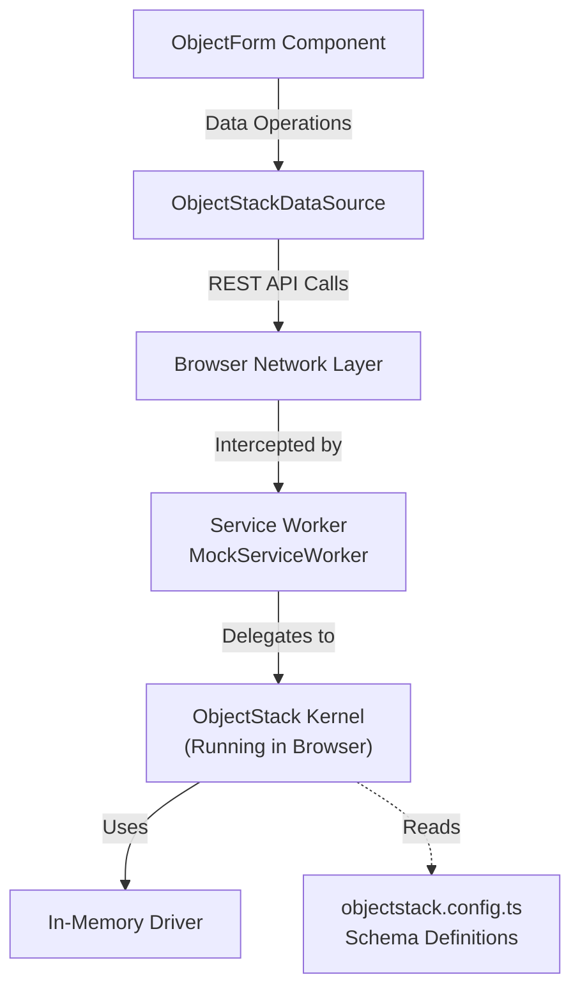

# MSW ObjectForm Example

This example demonstrates a complete **ObjectForm** integration with **Mock Service Worker (MSW)** for testing and development. It runs a real ObjectStack Runtime in the browser using an in-memory driver, allowing you to develop and test forms without a backend server.

## 🏗️ Architecture

This example uses the same architecture as the [msw-react-crud](https://github.com/objectstack-ai/spec/tree/main/examples/msw-react-crud) reference implementation:



## 🎯 Key Features

- **ObjectForm Component**: Smart form component that auto-generates forms from ObjectStack schemas
- **MSW Integration**: Complete ObjectStack runtime running in the browser via Service Worker
- **Full CRUD Operations**: Create, Read, Update, Delete contacts with validation
- **Real Logic**: Schema validation, defaults, and field types enforced by ObjectStack Kernel
- **Comprehensive Tests**: Test suite covering all form operations and field types
- **Zero Backend**: Develop and test frontend forms before backend exists

## 📦 What's Inside

### Core Files

- **`src/App.tsx`** - Main application component with ObjectForm integration
- **`src/components/ContactList.tsx`** - Contact list component with edit/delete
- **`src/dataSource.ts`** - ObjectStack DataSource adapter for ObjectForm
- **`src/mocks/browser.ts`** - MSW setup with ObjectStack Kernel
- **`objectstack.config.ts`** - Contact object schema definition

### Test Files

- **`src/__tests__/ObjectForm.test.tsx`** - Comprehensive test suite covering:
  - Create mode with field validation
  - Edit mode with data loading and updates
  - View mode (read-only)
  - Different field types (text, email, phone, checkbox, number, textarea)
  - Form callbacks (onSuccess, onCancel, onError)
  - Data persistence in MSW memory

## 🚀 Getting Started

### Installation

```bash
# Install dependencies (from repository root)
pnpm install

# Navigate to example directory
cd examples/msw-object-form
```

### Development

```bash
# Start development server
pnpm dev
```

Open [http://localhost:5173](http://localhost:5173) to view the app. You can:
- Create new contacts using the form
- Edit existing contacts
- Delete contacts
- See data persist in browser memory

### Testing

```bash
# Run tests
pnpm test

# Run tests in watch mode
pnpm test:watch

# Run tests with UI
pnpm test:ui
```

### Build

```bash
# Build for production
pnpm build

# Preview production build
pnpm preview
```

## 📝 Usage Example

### Basic ObjectForm Integration

```tsx
import { ObjectForm } from '@object-ui/plugin-form';
import { ObjectStackDataSource } from './dataSource';
import { ObjectStackClient } from '@objectstack/client';

// Initialize client and data source
const client = new ObjectStackClient({ baseUrl: '' });
await client.connect();
const dataSource = new ObjectStackDataSource(client);

// Render ObjectForm
<ObjectForm
  schema={{
    type: 'object-form',
    objectName: 'contact',
    mode: 'create', // or 'edit' or 'view'
    fields: ['name', 'email', 'phone', 'company'],
    layout: 'vertical',
    onSuccess: (data) => console.log('Created:', data),
  }}
  dataSource={dataSource}
/>
```

### Testing with MSW

```tsx
import { startMockServer } from './mocks/browser';
import { ObjectStackClient } from '@objectstack/client';

// Start MSW before tests
beforeAll(async () => {
  await startMockServer();
  
  client = new ObjectStackClient({ baseUrl: '' });
  await client.connect();
  
  dataSource = new ObjectStackDataSource(client);
});

// Test form creation
it('should create a contact', async () => {
  render(
    <ObjectForm
      schema={{
        type: 'object-form',
        objectName: 'contact',
        mode: 'create',
        fields: ['name', 'email'],
        onSuccess,
      }}
      dataSource={dataSource}
    />
  );

  await user.type(screen.getByLabelText(/name/i), 'Test User');
  await user.type(screen.getByLabelText(/email/i), 'test@example.com');
  await user.click(screen.getByRole('button', { name: /create/i }));

  await waitFor(() => {
    expect(onSuccess).toHaveBeenCalled();
  });
});
```

## 🔧 Customization

### Modify the Schema

Edit `objectstack.config.ts` to add/remove fields or change object properties:

```typescript
export const ContactObject = {
  name: 'contact',
  fields: {
    // Add your custom fields here
    custom_field: { 
      name: 'custom_field', 
      label: 'Custom Field', 
      type: 'text' 
    },
  }
};
```

### Add Custom Validation

Implement custom validation in the ObjectForm schema:

```tsx
<ObjectForm
  schema={{
    customFields: [
      {
        name: 'email',
        label: 'Email',
        type: 'email',
        validation: {
          pattern: /^[^\s@]+@[^\s@]+\.[^\s@]+$/,
          message: 'Invalid email format'
        }
      }
    ]
  }}
/>
```

## 📚 Learn More

- [ObjectForm Documentation](../../packages/plugin-form/README.md)
- [ObjectStack Documentation](https://objectstack.dev)
- [MSW Documentation](https://mswjs.io/)
- [Reference Example](https://github.com/objectstack-ai/spec/tree/main/examples/msw-react-crud)

## 🧪 Test Coverage

The test suite covers:

✅ Create mode with all field types  
✅ Form validation (required fields, field types)  
✅ Default values from schema  
✅ Edit mode with data loading  
✅ Update operations  
✅ View mode (read-only)  
✅ Error handling  
✅ Form callbacks (onSuccess, onCancel, onError)  
✅ Data persistence in MSW memory  
✅ Various field types (text, email, phone, number, checkbox, textarea)

## 📄 License

MIT © ObjectStack Inc.
