# Browser verification — Gantt Phases 1–5

Automated end-to-end verification of the Gantt plugin in a real Chromium
browser, driven by [`scripts/verify-browser.mjs`](../../scripts/verify-browser.mjs)
against the demo app ([`demo/`](../../demo/)). The script asserts behavior via
the DOM and persists the screenshots in this directory; `results.json` holds
the machine-readable outcome of the latest run.

Run it with the demo server up:

```sh
pnpm --dir packages/plugin-gantt exec vite demo --port 5199
node packages/plugin-gantt/scripts/verify-browser.mjs
```

## Latest run: 18/18 checks passed

### 1. Hierarchy, milestones, dependency links

- 13 tree rows (3 summary groups + 8 tasks + 2 milestones), 3 solid summary
  bars (title + rollup progress fill), 2 milestone diamonds.
- 10 dependency arrows covering **all four link types** (`fs`, `ss`, `ff`,
  `sf`), plus the red Today line and both custom markers (Sprint 2,
  Code freeze).
- 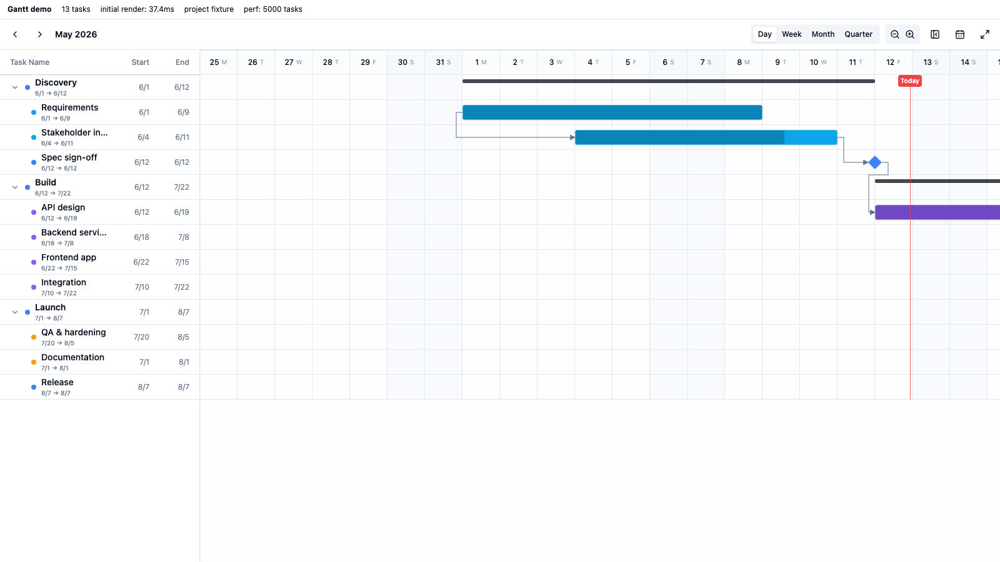
- 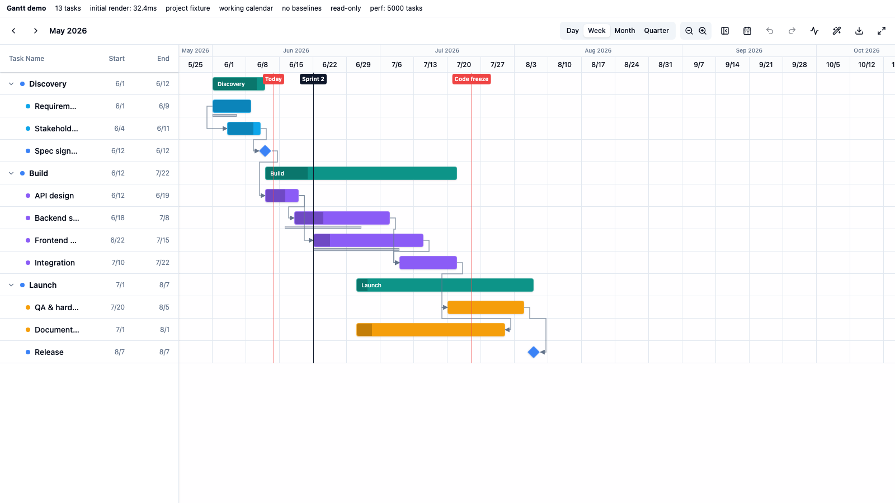

### 2. Collapse / expand

- Collapsing the *Build* summary hides its 4 child rows (13 → 9) and the
  links into the subtree (10 → 4); expanding restores all 13 rows.
- 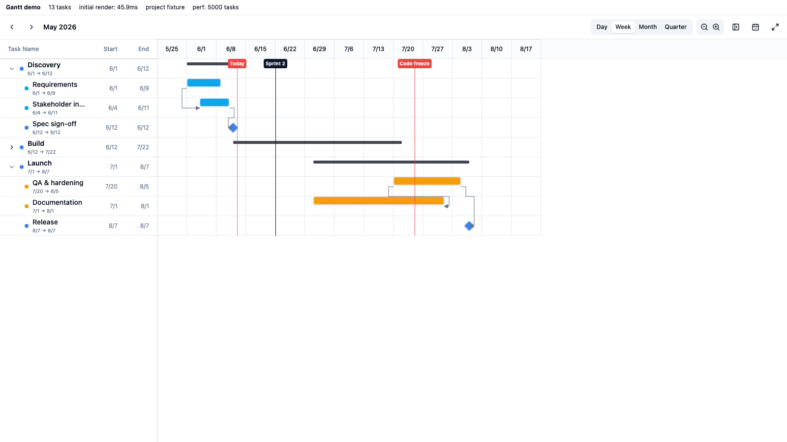

### 3. Hover tooltip + link highlight

- Hovering *Backend services* shows the tooltip (`Jun 18 → Jul 8 · 20d · 30%`)
  and highlights exactly its 2 links (t3→t4, t4→t6).
- 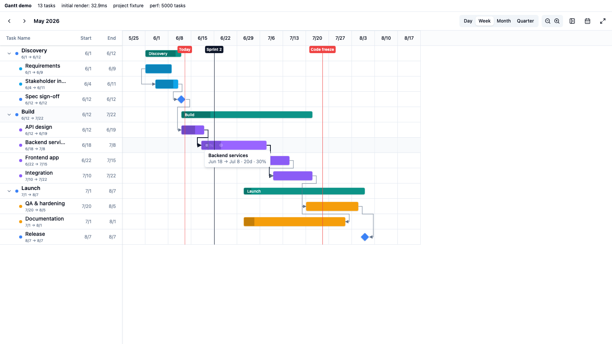

### 4. Drag-to-create dependency

- A real mouse drag from the link dot of *Documentation* onto *Frontend app*
  shows the dashed rubber band mid-drag; dropping creates the new `t8 → t5`
  arrow.
- 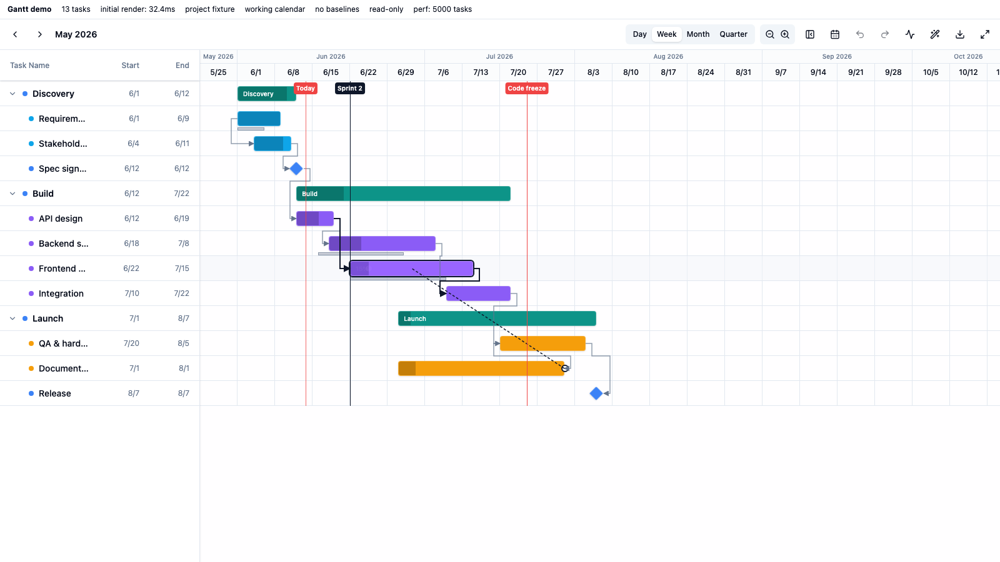
- 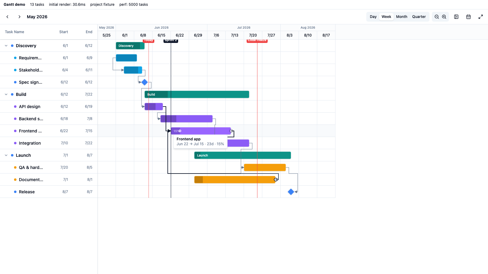

### 4b. Pixel-level arrow geometry audit

[`scripts/audit-geometry.mjs`](../../scripts/audit-geometry.mjs) parses every
arrow's SVG path and measures its endpoints against the live DOM rects of the
source/target bars, across three scenarios (project fixture in day and week
mode, plus a `?edge=1` fixture with backward links of every type, links into
summary rows, and milestone→milestone chains). **All 29 measured endpoints are
within ±0.4 px** of the expected anchors:

- task bars: edge × vertical center (bars carry explicit inline `top`/`height`
  so they are exactly row-centered),
- milestones: the diamond's visual tip (half a diagonal out from center),
- summary rows: the solid summary bar's own center (row-centered, slightly
  slimmer than task bars).

Zoomed clips of each arrow's target anchor are saved under
[`geometry/`](geometry/), e.g. an `fs` arrow meeting a milestone tip:

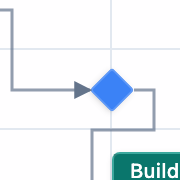

### 4c. Summary group drag + parent rollup on child drag

[`scripts/verify-group-drag.mjs`](../../scripts/verify-group-drag.mjs) drives
real mouse drags in week mode (5/5 checks passed):

- Dragging the *Build* summary bar moves the **whole subtree**: mid-drag
  every child bar preview-shifts with the summary and a date chip shows the
  new range; on drop all 5 tasks commit exactly +14 days with durations and
  internal spacing preserved.
- Dragging the *Integration* child +7 days past the parent's end stretches
  the summary bar via rollup — parent start stays pinned to the earliest
  child, parent end follows the moved child.
- 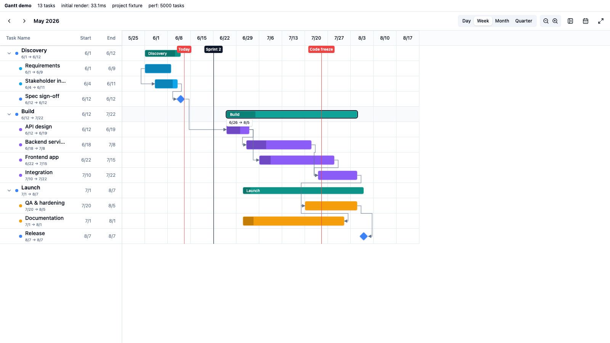
- 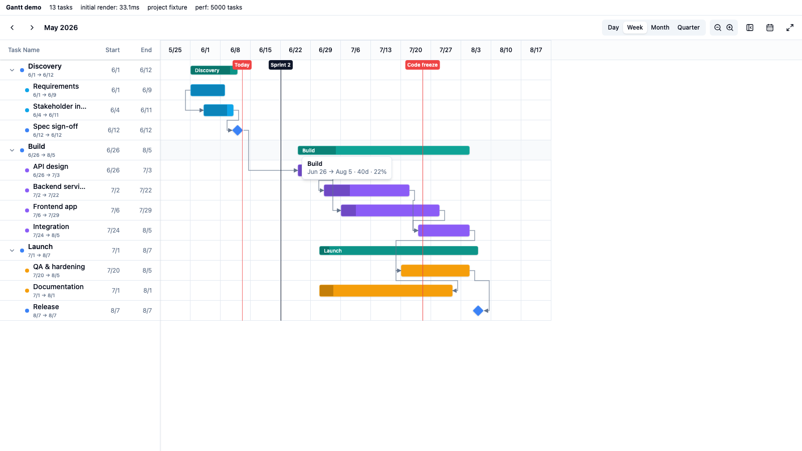
- 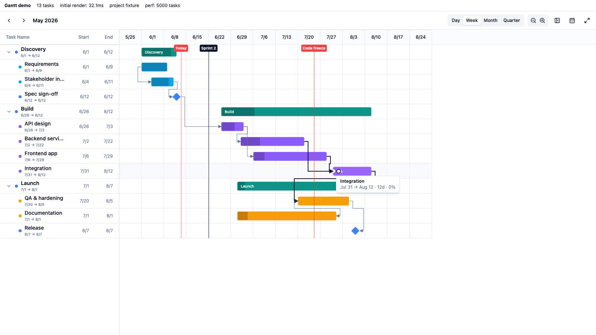

### 4d. Configurable hover tooltip (悬浮详情 / `tooltipFields`)

The tooltip is now dynamically configurable like the component's other
field-bound properties. A view declares `tooltipFields` on its gantt config
(field names, or `{ field, label }` to override the label); ObjectGantt
resolves each against the record — select options → their label, lookups →
the embedded record name, dates/numbers/currency/percent through the shared
`@object-ui/fields` formatters — and feeds them to `GanttView` as
`task.fields`. When present they replace the default
start → end · duration · progress line; when unconfigured the default line
is kept.

[`scripts/verify-tooltip-fields.mjs`](../../scripts/verify-tooltip-fields.mjs)
hovers *Backend services* (configured with Owner / Status / Effort) and
asserts the tooltip renders those label/value rows instead of the date line
(6/6 checks passed):

- 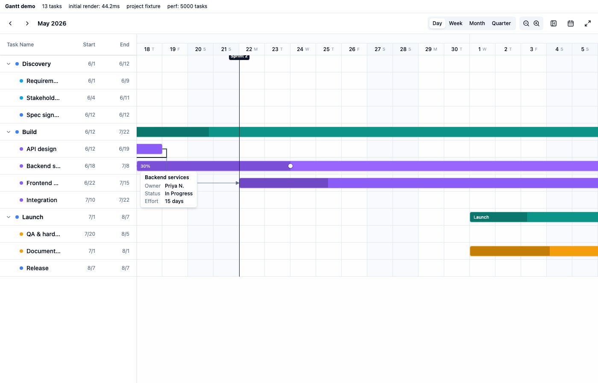

### 4e. Live parent stretch on child drag

When a child task is dragged past its parent's current extent, the parent
summary bar now re-rolls and stretches **in real time during the drag**, not
just on drop — matching the rollup that commits when the pointer is released.
Every ancestor summary of the dragged task stretches; the parent's pinned edge
(earliest child) stays put, so it grows rather than shifts.

[`scripts/verify-child-stretch.mjs`](../../scripts/verify-child-stretch.mjs)
drags *Backend services* three weeks right (new end Jul 29, overshooting the
Build group's Jul 22 edge) and asserts, mid-drag, that the p2 bar widens ~7d
with its left edge pinned, then stays widened after drop with no flicker
(4/4 checks passed):

- 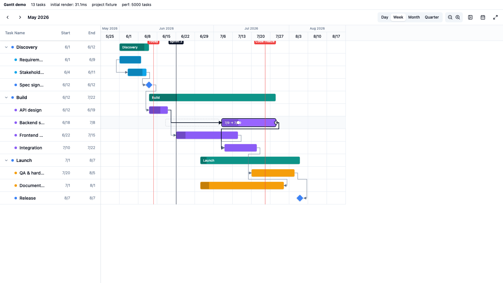
- 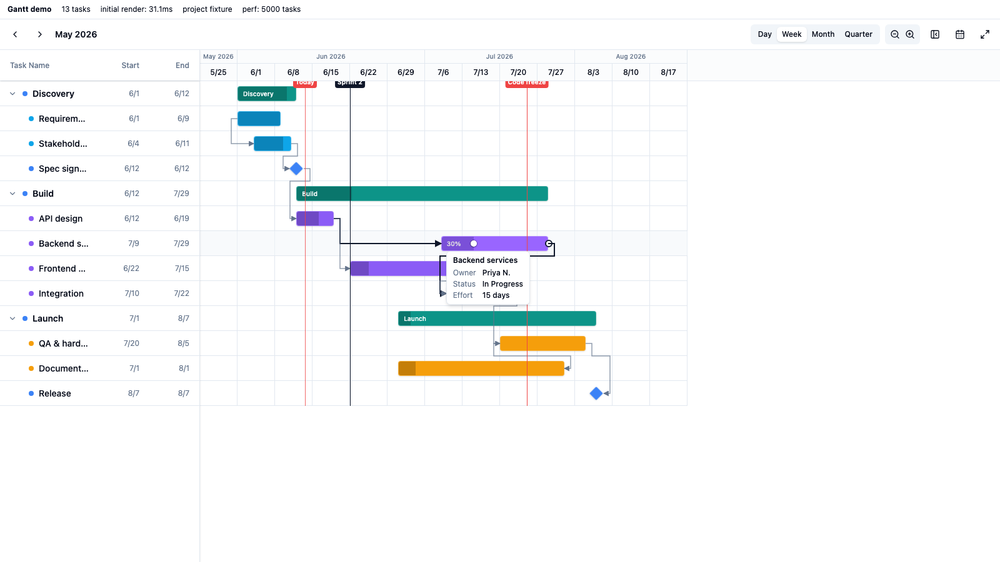

### 5. Performance — 5,000 tasks (`?perf=5000&mode=week`)

| Metric | Result |
| --- | --- |
| Initial render (5,000 tasks) | **27 ms** |
| Rows in the DOM | **26** of 5,000 |
| Week columns in the DOM | **26** |
| Window shift after jumping to the middle of the list | **40.5 ms** |
| Rows in the DOM after the jump | 32 |

- 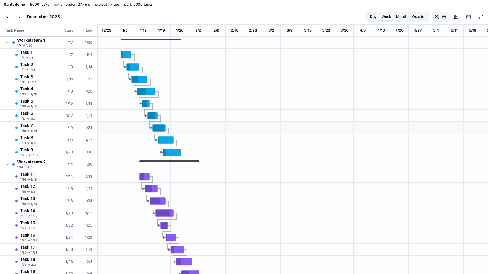
- 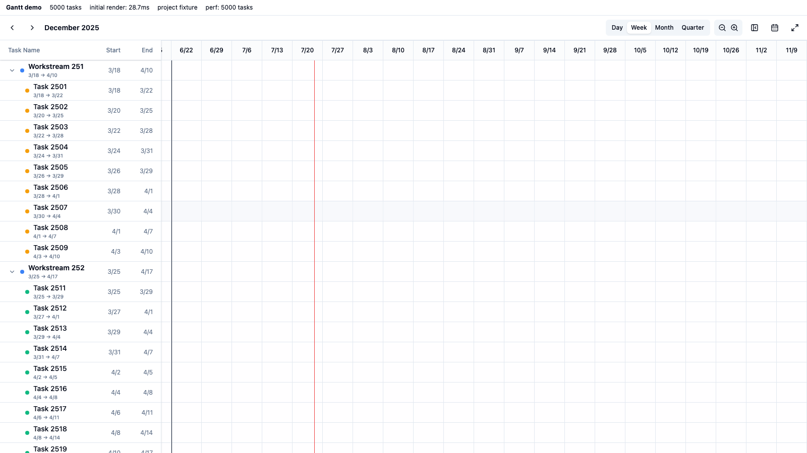

### 6. Performance — 10,000 tasks (`?perf=10000`)

[`scripts/perf-10k.mjs`](../../scripts/perf-10k.mjs) runs a heavier stress
suite against `?perf=10000&mode=week` (1,000 summary groups × 10 chained
tasks) and persists [`perf-10000-metrics.json`](perf-10000-metrics.json):

| Metric | Result |
| --- | --- |
| Initial render (10,000 tasks) | **59.2 ms** |
| Rows / DOM nodes in the document | **26 rows / 674 nodes** (virtualized) |
| Deep jump to 25 / 50 / 75 / 100% of ~400k px scroll height | 30.4 / 29.3 / 29.3 / **28.5 ms** |
| Sustained vertical scroll, 120 frames × 300 px | avg **17.2 ms** (~58 fps), p95 21.3 ms, max 28.9 ms |
| Horizontal scroll, 60 frames × 200 px | avg **16.7 ms**, max 27.9 ms |
| View-mode switch week→month / month→week | 120 ms / 67 ms |
| Collapse a summary group | 80 ms |
| Hover → tooltip visible | 62 ms |
| JS heap | 141 MB |

Every frame stays under the 33 ms (30 fps) jank threshold; the average sits at
the 60 fps budget. DOM size is independent of task count, so scrolling cost is
flat from 1k to 10k rows.

- 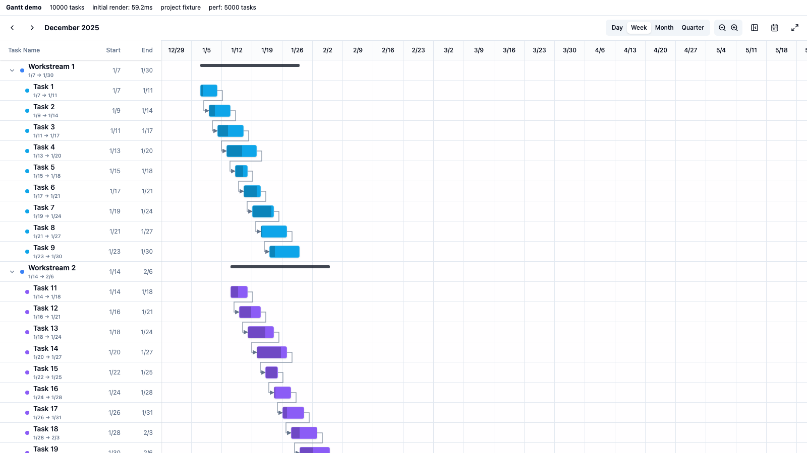
- 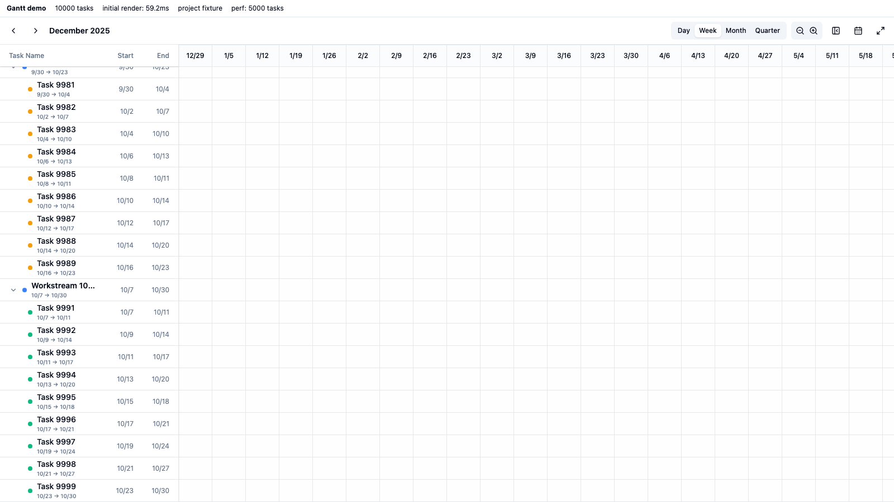
- 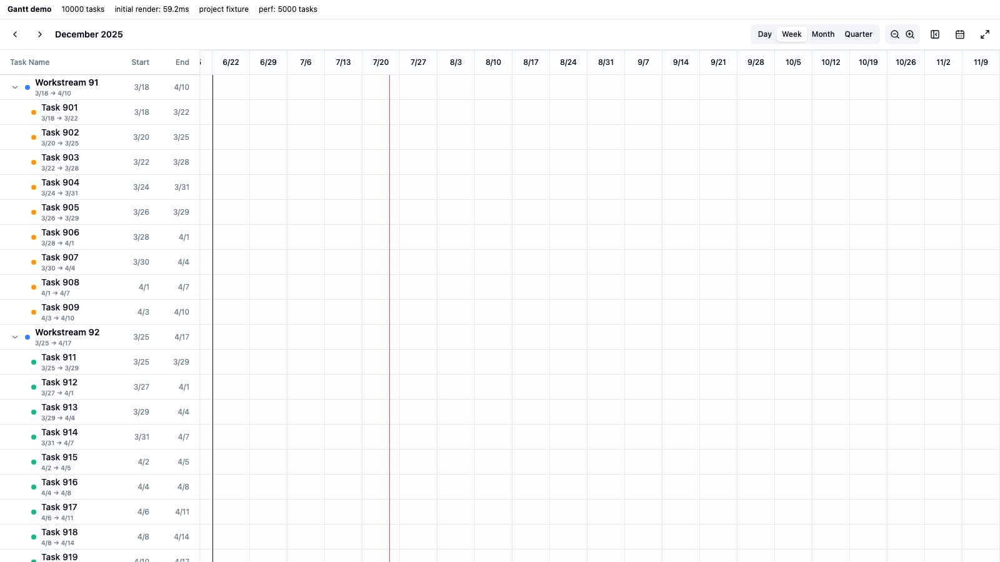

---

# Phase 6 — critical path, auto-schedule, export PNG

Driven by [`scripts/verify-phase6.mjs`](../../scripts/verify-phase6.mjs)
against the demo (`?critical=1` starts the highlight on). All three features
are pure additions — read-only display (critical path), an explicit one-shot
action (auto-schedule), and a client-side raster (export). The underlying
graph maths live in [`src/scheduling.ts`](../../src/scheduling.ts) and are
unit-tested in [`src/scheduling.test.ts`](../../src/scheduling.test.ts)
(12 cases).

Run it with the demo server up:

```sh
pnpm --dir packages/plugin-gantt exec vite demo --port 5199
node packages/plugin-gantt/scripts/verify-phase6.mjs
```

## Latest run: 13/13 checks passed

### 1. Critical path (CPM)

A toolbar toggle (Activity icon) runs a forward/backward CPM pass over the
dependency graph and highlights the zero-slack chain in red — task bars,
milestones, summary bars and the joining link arrows.

- The long leg **t1 → t2 → m1 → t3 → t5 → t6 → t7 → t8** is critical.
- The diamond's parallel legs prove the maths: **t5** (Frontend, 23d) is
  critical while **t4** (Backend, 20d) — which shares predecessor t3 and
  successor t6 — is *not*, because its slack is non-zero.
- Toggling off clears every `data-critical` flag.
- 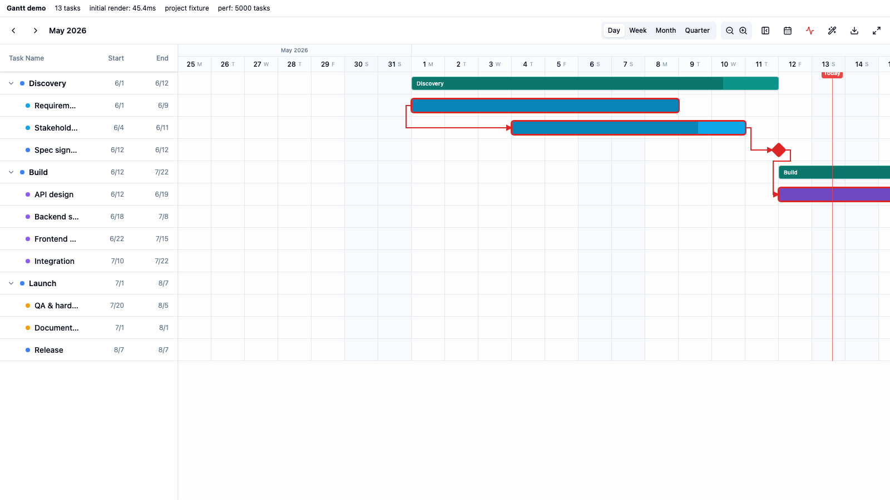

### 2. Auto-schedule (顺延)

A toolbar button (Wand2 icon, shown only when `onTaskUpdate` is wired) runs a
one-shot dependency reschedule: each task is pushed as late as its links
require, durations preserved, never pulled earlier. On the fixture this shifts
**t4, t6, t7** later to clear their finish-to-start overlaps, cascading down
the chain; summary (parent) bars are left as derived rollups.

- 

### 3. Export PNG

A toolbar button (Download icon) rebuilds the **whole** chart (every row,
unaffected by row virtualization) into a standalone SVG using concrete hex
colors — the prebuilt theme CSS vars don't resolve in a detached SVG — then
rasterizes it to a 2× PNG via a canvas and downloads `gantt-<mode>.png`.
Zero third-party dependencies.

- The latest run produced a valid SVG (0 NaN coordinates) rasterized to an
  **11920×1096** `gantt-day.png` (~334 KB).
